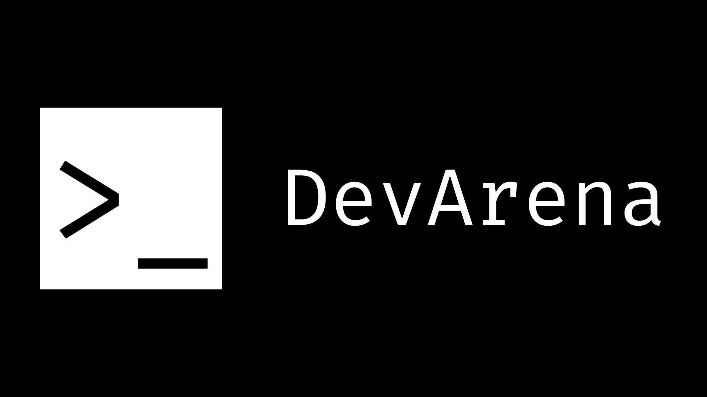

# DevArena Platform

<div align="center">
  
  
  <p align="center">
    <strong>Your central hub for discovering developer competitions, hackathons, coding contests, and AI/data science challenges from across the web.</strong>
  </p>
  
  <p align="center">
    <a href="https://devarena.onrender.com" target="_blank">🚀 Live Demo</a> •
    <a href="#-features">Features</a> •
    <a href="#%EF%B8%8F-tech-stack">Tech Stack</a> •
    <a href="#-architecture">Architecture</a>
  </p>
</div>

---

## 🎯 What is DevArena?

DevArena aggregates competitions from 500+ platforms into a single, searchable hub. Instead of checking multiple websites daily, DevArena brings all competitions to you with smart filtering, bookmarking, and real-time updates.

**Perfect for:** Competitive programmers, AI/ML engineers, security researchers, and developers looking to showcase their skills.

## ✨ Features

- 🔍 **Unified Search** - Search across 500+ competition platforms
- 🎯 **Smart Filtering** - Filter by category, platform, date, status, and prize
- 📅 **Date Range Picker** - Find competitions within specific timeframes
- 🔖 **Bookmarking System** - Save and organize favorites
- 🔐 **JWT + OAuth 2.0** - Secure authentication with Google/GitHub login
- 🌓 **Dark Mode** - Beautiful themes with system detection
- 📱 **Responsive Design** - Works on desktop, tablet, and mobile
- ⚡ **Real-time Updates** - Automated sync every 6 hours
- 🎨 **Netflix-style UI** - Horizontal scrolling competition cards
- 🛡️ **Enterprise Security** - Helmet.js, rate limiting, CSRF protection

## �️ Tech Stack

**Frontend**
- React 18 + Vite
- TailwindCSS
- React Router v6
- Axios + Context API

**Backend**
- Express.js + PostgreSQL
- JWT + bcrypt + OAuth 2.0
- node-cron (automated sync)
- Helmet.js (security headers)
- Winston (production logging)

**Testing**
- Vitest + React Testing Library
- Jest + Supertest
- fast-check (Property-Based Testing)
- Playwright (E2E)

## 📁 Architecture

```
devarena-platform/
├── frontend/                 # React frontend
│   ├── src/
│   │   ├── components/      # UI components
│   │   ├── pages/           # Page components
│   │   ├── context/         # Auth & theme context
│   │   ├── services/        # API client
│   │   └── assets/          # Images & logos
│   └── package.json
│
├── backend/                  # Express.js API
│   ├── src/
│   │   ├── routes/          # API endpoints
│   │   ├── services/        # Business logic
│   │   ├── middleware/      # Auth, CSRF, security
│   │   ├── parsers/         # API response parsers
│   │   └── utils/           # DB, logger, helpers
│   ├── migrations/          # Database migrations
│   └── package.json
│
└── package.json              # Root (monorepo)
```

## 🚀 Quick Start

### Prerequisites
- Node.js >= 18.0.0
- PostgreSQL >= 14
- npm >= 9.0.0

### Installation

```bash
# 1. Clone and install
git clone <repository-url>
cd devarena-platform
npm run install:all

# 2. Setup environment
cp .env.example .env
# Edit .env with your configuration

# 3. Setup database
createdb devarena
cd backend && npm run migrate && cd ..

# 4. Start development
npm run dev
```

**Access:** Frontend at http://localhost:5173, API at http://localhost:3000

## 🚢 Deployment

### Deploy to Render (Recommended)

DevArena is optimized for deployment on Render's container-based platform, which provides:
- **Stable database connections** through persistent containers
- **Reliable OAuth authentication** with consistent routing
- **Simplified build process** with straightforward dependency installation
- **Automatic deployments** on git push

**Quick Deploy:**
1. Create a Render account at https://render.com
2. Connect your GitHub repository
3. Configure environment variables (see below)
4. Deploy with one click

**Detailed Deployment Guide:**
See [RENDER_DEPLOYMENT_GUIDE.md](RENDER_DEPLOYMENT_GUIDE.md) for comprehensive deployment instructions, OAuth configuration, troubleshooting, and monitoring setup.

**Environment Variables Required:**
- `DATABASE_URL` - PostgreSQL connection string (use Supabase direct connection)
  - **IMPORTANT**: For Render, use direct connection (port 5432): `postgresql://...@db.<project>.supabase.co:5432/postgres`
  - Do NOT use pooler URL - Render's persistent container uses direct connections
- `JWT_SECRET` - Generate with: `openssl rand -hex 32`
- `CLIST_API_KEY` - Get from [clist.by](https://clist.by/)
- `CORS_ORIGIN` - Your Render domain (e.g., `https://devarena.onrender.com`)
- `APP_URL` - Your Render domain (e.g., `https://devarena.onrender.com`)
- `API_URL` - Your Render domain (e.g., `https://devarena.onrender.com`)
- `GOOGLE_CLIENT_ID` - From Google Cloud Console
- `GOOGLE_CLIENT_SECRET` - From Google Cloud Console
- `GITHUB_CLIENT_ID` - From GitHub Developer Settings
- `GITHUB_CLIENT_SECRET` - From GitHub Developer Settings
- `NODE_ENV=production`
- **Note**: Do NOT manually set `PORT` - Render auto-injects this

**OAuth Configuration:**
- Google Console: Set redirect URI to `https://devarena.onrender.com/api/auth/oauth/google/callback`
- GitHub Settings: Set callback URL to `https://devarena.onrender.com/api/auth/oauth/github/callback`

**Database Options for Production:**
- [Supabase](https://supabase.com) - Recommended, free tier available (use direct connection for Render)
- [Neon.tech](https://neon.tech) - Serverless PostgreSQL
- [Railway](https://railway.app) - Simple setup

### Other Deployment Options

**Docker:**
```bash
docker-compose -f docker-compose.prod.yml up -d
```

**Manual:**
```bash
cd frontend && npm run build
cd ../backend && NODE_ENV=production node src/server.js
```

## 📝 License

MIT License

## 🙏 Acknowledgments

- **CLIST.by** - Competition data (300+ platforms)
- **Kaggle** - ML/AI competition data
- **React, Express.js, PostgreSQL, TailwindCSS, Vite**

---

**Built with ❤️ for the developer community**
